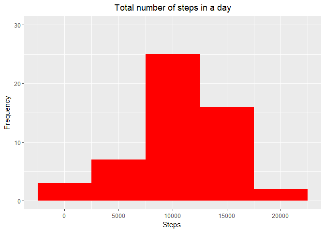
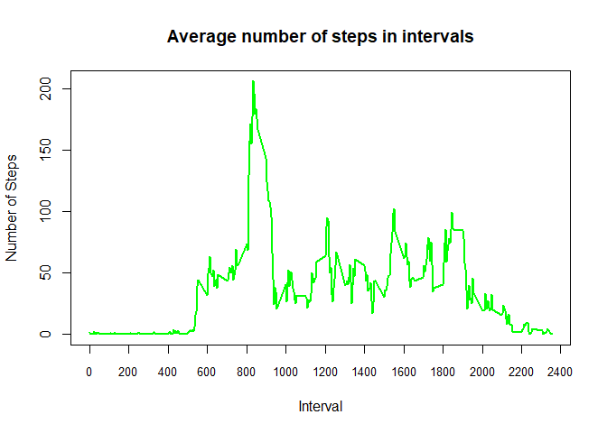

# PA1_template
Bikash Sarangi  
6 August 2017  


# 1. Loading and preprocessing the data  


Code provided below helps read the csv file, eliminate scientific notation for numbers. The dataframe with the raw data read in is titled activity. 

### A. Load the data

```r
options(scipen = 999)
activity <-read.csv("activity.csv", stringsAsFactors = FALSE) 
```

### B. Process/transform the data (if necessary) into a format suitable for analysis

The 'date' field in the dataframe is transformed from a character to a date. This will help in the analysis later. A new dataframe called activityNew is created which excludes the rows with steps = NA. 


```r
activity$date <- as.Date (as.POSIXct(activity$date, format = "%Y-%m-%d"))
activityNew <- na.omit(activity)
```

# 2. What is mean total number of steps taken per day?

For this part of the assignment, missing values in the dataset are ignored. So the dataframe activityNew is used.

### A. Make a histogram of the total number of steps taken each day

Histogram is created using gglpot2 package.


```r
library(ggplot2)
stepsM <- aggregate(activityNew$steps ~ with(activityNew, date), FUN = sum)
p <- ggplot(stepsM, aes(stepsM$`activityNew$steps`))+
  geom_histogram(fill =  "red", binwidth = 5000) +
  labs(x = "Steps ") + 
  labs(y= "Frequency") + 
  ggtitle("Total number of steps in a day")+
  theme(plot.title = element_text(hjust = 0.5))+
  scale_y_continuous(limits=c(0, 30))
suppressMessages(print(p))
```

<!-- -->

### B. Calculate and report the mean and median total number of steps taken per day


```r
meanTime <- mean(stepsM$`activityNew$steps`)
medTime <- median(stepsM$`activityNew$steps`)
```
The mean number of steps is 10766.1886792 while the median number of steps is 10765.

# 3. What is the average daily activity pattern?

### A. Make a time series plot (i.e. type = "l") of the 5-minute interval (x-axis) and the average number of steps taken, averaged across all days (y-axis)

Time series plot has been created using the base plotting system.


```r
intervalM <- aggregate(steps~interval, activityNew, FUN = mean)
plot (  
  intervalM$interval,
  intervalM$steps,
  type='l',
  xaxt ='n',
  xlab = "Interval",
  ylab= 'Number of Steps',
  main = "Average number of steps in intervals",
  col='green',
  lwd=2)
axis(1, at = seq(0, 2500, by = 200), labels= seq(0, 2500, by = 200), cex.axis = 0.8)
```

<!-- -->


### B. Which 5-minute interval, on average across all the days in the dataset, contains the maximum number of steps?


```r
pos <- which.max(intervalM$steps)
maxInt <- intervalM[pos ,1]
stepsInt <- intervalM[pos ,2]
```

The 5-minute interval, which on average across all the days in the dataset contains the maximum number of steps, is 835 with  206.1698113 steps.

# 4. Imputing missing values

### A. Calculate and report the total number of missing values in the dataset (i.e. the total number of rows with NAs)


```r
missing <- nrow(activity) - nrow(activityNew)
```

The total number of missing values in the dataset (i.e. the total number of rows with NAs) is 2304.

### B. Devise a strategy for filling in all of the missing values in the dataset. The strategy does not need to be sophisticated. 

We have used the mean for that 5-minute interval for filling up missing data.


```r
intervalMed <- aggregate(steps~interval, activityNew, FUN = mean)
allMissing <- subset(activity, is.na(activity$steps))
allMissing$stepsNew <- subset(intervalMed, intervalMed$interval==allMissing$interval)[,2] 
```

### C. Create a new dataset that is equal to the original dataset but with the missing data filled in.


```r
activityNew$stepsNew <- activityNew$steps
activityFilled <- rbind(activityNew, allMissing)
```

The new dataset is 'activityFilled'.

### D. Make a histogram of the total number of steps taken each day

Histogram has been created using ggplot2 package.


```r
stepsMod <- aggregate(stepsNew ~ date, activityFilled, FUN = sum)
g <- ggplot(stepsMod, aes(stepsNew))+
  geom_histogram(fill =  "green", binwidth = 5000) +
  labs(x = "Steps ") +
  labs(y= "Frequency") +
  ggtitle("Total number of steps in a day - Missing Data Imputed")+
  theme(plot.title = element_text(hjust = 0.5))+
  scale_y_continuous(limits=c(0, 40))
suppressMessages(print(g))
```

<!-- -->

### E. Calculate and report the mean and median total number of steps taken per day.


```r
meanTimeMod <- mean(stepsMod$stepsNew)
medTimeMod <- median(stepsMod$stepsNew)
```
The mean number of steps is 10766.1886792 while the median number of steps is 10765.5943396.

### F. Do these values differ from the estimates from the first part of the assignment?

Not materially.

### G. What is the impact of imputing missing data on the estimates of the total daily number of steps?

Mean remains the same while median has barely increased.

# Are there differences in activity patterns between weekdays and weekends?

```r
weekEnd <- function(d){
  z <- weekdays(as.Date(d))
  if (z %in% c("Saturday","Sunday")){
    "Weekend"
  }else
  {
    " Weekday"
  }
}
size <- dim(activityFilled)[1]
for (i in 1:size){
  activityFilled[i,5] <- weekEnd(activityFilled[i,2])
}

colnames(activityFilled)[5] <- "weekDay"
activityFilled$"weekDay" <- as.factor(activityFilled$"weekDay")
stepsFilled <- aggregate(stepsNew ~ weekDay+interval, activityFilled, FUN = mean)
gg <- ggplot(stepsFilled, aes(x = interval, y = stepsNew))+
  geom_line(color =  "green", size = 2) +
  labs(y= "Steps") +
  ggtitle("Total number of steps in a day - Weekend Patterns with Missing Data")+
  scale_x_continuous("Interval", breaks = seq(min(stepsFilled$interval), max(stepsFilled$interval)+ 100, 200)) +
  theme(plot.title = element_text(hjust = 0.5))+
  facet_wrap(~ weekDay, scale ="fixed", nrow = 2)+
  theme_light()
suppressMessages(print(gg))
```

<!-- -->

As can be seen, there are differences in activity patterns between weekend and weekdays. On weekend, activity is uniform across different times of the day whereas on weekdays activity is concentrated around 0800-0900 in keeping with office timings.   
